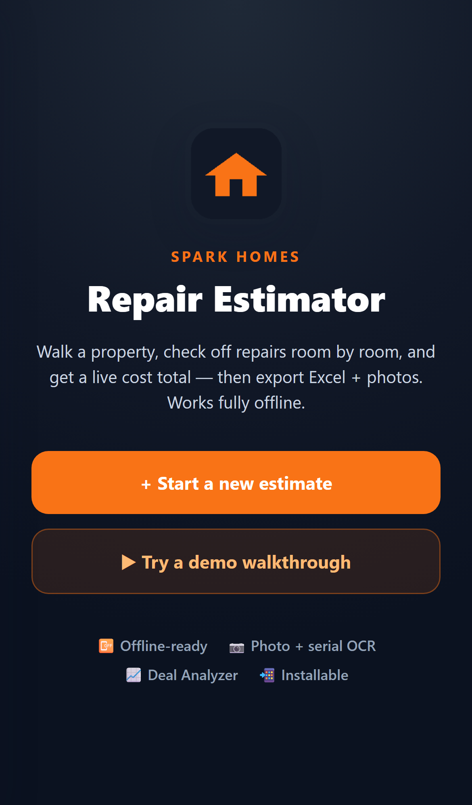
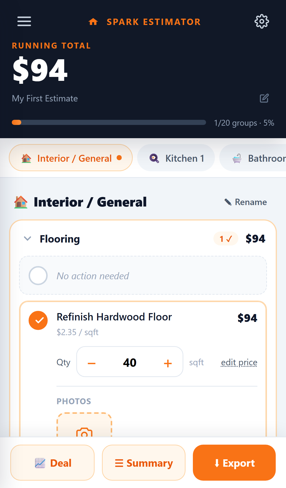
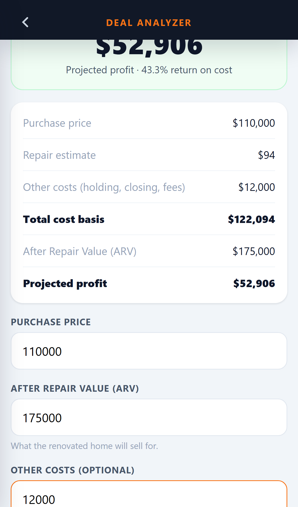

# Spark Homes — Repair Cost Estimator (PWA)

> **A cold, empty house with one bar of signal — and a number that decides the deal.**
> This app turns the repair estimate from a guess into a structured, room-by-room
> walkthrough that produces a defensible number *and* a go/no-go before the agent
> leaves the driveway. A ~20-minute spreadsheet scramble, compressed to ~5 minutes.

A mobile-first, **fully offline** repair-cost estimator for Spark Homes' acquisition
team. An agent walks a property on their phone, checks off needed repairs room by
room, enters quantities, snaps photos of serial plates, and gets a live running
total — then exports a ZIP (Excel + photos) to share with the team.

Built from scratch as an original submission. No build step, no server, no
framework. Open `index.html` from any static host and it runs.


<p>
  
  
  
</p>

> **Live demo:** **https://saissd.github.io/spark-estimator/**
> Open it on your phone and tap **Try a demo walkthrough**. Add it to your home
> screen to install it, then turn on airplane mode — it keeps working.

---

## Quick start

It's static files — serve the folder over HTTP (a service worker needs `http://`
or `https://`, not `file://`):

```bash
# from the project root
python -m http.server 8000
# then open http://localhost:8000 on your phone or desktop
```

Or drop the folder on any static host (GitHub Pages, Netlify, Vercel, S3). To
**install as an app**, open it in Chrome (Android) or Safari (iOS) and choose
*Add to Home Screen* — it launches standalone and works with no network.

---

## What's included (maps to the brief)

| Requirement | Where |
| --- | --- |
| 75+ line items, 5 sections, 19 groups | `js/data.js` — 108 items keyed by CSV `id` |
| "No Action Needed" per group | every group renders a No-Action toggle |
| Price override (per-project **and** global) | `edit price` on any item → optional "update everywhere" |
| Add / delete line items per item | `+ Add line item` in each group; delete from the price sheet |
| Adjustable rooms | add/remove instances; Bathroom 1/2, Bedroom 1/2, Kitchen, Living |
| Bedroom & Living decoupled from Interior | separate room types with their own groups (`ROOM_TYPES` in `js/data.js`) |
| Progress tracking | per-group completion, overall % bar in the header |
| Photo capture | device camera → stored as blobs in **IndexedDB** |
| Serial-number capture | serial-flagged items auto-read via offline OCR; rides into the export filename |
| Notes | per-item + project notes that flow into the Excel export as a crew scope of work |
| Export ZIP (Excel + photos) | `js/export.js` — SheetJS workbook + JSZip, auto-downloads |
| Offline / installable PWA | `sw.js` (cache-first shell) + `manifest.json` |
| Creative addition | **Deal Analyzer** — purchase + ARV − repair = projected profit + go/no-go |

---

## Built for how Spark works

Spark isn't a one-deal shop — it's a multi-division operation (Spark Homes + an
in-house **Spark Construction** crew) doing volume. Two design choices follow from that:

- **Consistency across agents.** A shared, editable standard price list (global
  overrides + per-project overrides) means every agent's estimate is built on the
  same numbers — directly addressing the brief's "inconsistent between agents" pain.
- **The estimate feeds the crew.** Because the renovation is done in-house, the export
  isn't just an offer justification — it's a **scope of work**. Per-item and project
  notes ("tub cracked — full tearout, not a reglaze") ride into the Excel file so the
  construction team gets the agent's context, not just line totals.

## Architecture

```
index.html          app shell + script/style includes
css/styles.css      hand-written design system (no Tailwind → faster cold start, offline-safe)
js/data.js          catalog (from Pricing List.csv), 19 groups, room types  [single source of truth]
js/store.js         persistence: localStorage (projects/prices) + IndexedDB (photo blobs)
js/export.js        Excel + ZIP builder
js/app.js           controller: state, rendering, all interactions
vendor/             SheetJS + JSZip, vendored locally (NOT hot-linked → work offline)
manifest.json, sw.js, icons/   PWA shell
```

### Two deliberate engineering decisions

1. **Photos in IndexedDB, not localStorage.** localStorage caps near ~5 MB; a few
   phone photos as base64 blow that and silently corrupt saved work. Photo blobs
   go in IndexedDB (scales to hundreds of MB); only small JSON lives in
   localStorage. This is the difference between an app that survives a real
   walkthrough and one that loses data on photo #4.

2. **Vendored libraries + cache-first service worker.** The Excel/ZIP libraries
   are served from `vendor/` and cached by the service worker on first load.
   The app is genuinely usable in a dead-signal house — the most common failure
   mode for a field PWA is a CDN that won't load when you're offline.

### Data model

- A **project** holds rooms, entries (`roomId::itemId → {checked, qty, serial}`),
  per-project price overrides, custom items, deletions, and the deal inputs.
- The **catalog** is anchored on the CSV `id` exactly as the brief requires.
- **Prices** resolve in order: per-project override → global price list → CSV
  default, so both "override for this project" and "update standard pricing
  globally" fall out of one model.

---

## Testing

A real end-to-end suite lives in [`tests/`](tests/) (Playwright, emulated phone).
It covers the first-run welcome, demo load, check/quantity/total, per-group progress,
"No Action Needed", room add + whole-house singleton rule, the Deal Analyzer,
HTML-injection escaping, ZIP export, state persistence across reload, and **a full
offline reload with the network cut**.

```bash
cd tests
npm install
npx playwright install chromium   # first time only
npm test
```

The config starts a throwaway static server automatically — no manual setup. All
10 tests pass. (Photo → IndexedDB → ZIP and the offline serial OCR are additionally
verified by hand on-device.)

---

## Deploy (GitHub Pages — free, gives you the live URL reviewers want)

From inside the `spark-estimator/` folder:

```bash
git init
git add .
git commit -m "Spark Homes repair estimator"
git branch -M main
# create an empty repo on github.com first, then:
git remote add origin https://github.com/<you>/spark-estimator.git
git push -u origin main
```

Then on GitHub: **Settings → Pages → Build and deployment → Source: Deploy from a
branch → Branch: `main` / root → Save.** In ~1 minute your app is live at
`https://<you>.github.io/spark-estimator/`. Paste that URL at the top of this README
and in your submission email.

> The app is plain static files, so any static host works (Netlify drop, Vercel,
> S3, Cloudflare Pages). A service worker needs HTTPS — GitHub Pages provides it.

## Libraries

- [SheetJS (xlsx-js-style)](https://github.com/gitbrent/xlsx-js-style) — Excel export
- [JSZip](https://stuk.github.io/jszip/) — ZIP packaging
- [Tesseract.js](https://github.com/naptha/tesseract.js) — offline serial-number OCR (lazy-loaded)

All vendored under `vendor/` so the app has zero runtime network dependencies. The
OCR engine is fetched on first scan and cached by the service worker thereafter.

## License / use

Built for the Spark Homes developer contest. Original work.
